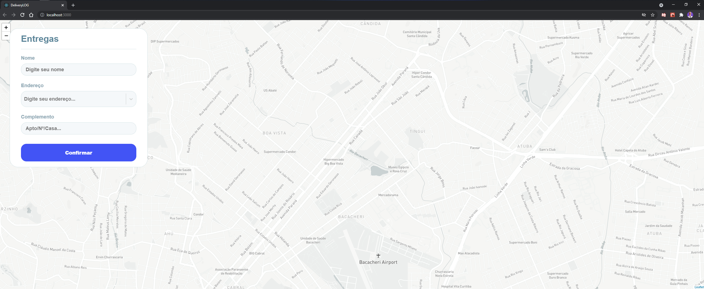

<h1 align="center">
DeliveryLOG
</h1>

<p align="center">
    
</p>

<hr>

## Teconologias utilizadas

- [React](https://expressjs.com/pt-br/)
- [TypeScript](https://nodejs.org/en/)
- [react-leaflet](https://react-leaflet.js.org/)
- [NodeJS](https://nodejs.org/en/)

## Local development

1. Criar o arquivo `.env` com as variáveis de desenvolvimento:
para gerar o token estou utilizando [MapBox](https://www.mapbox.com/).

```
REACT_APP_ACCESS_TOKEN_MAP_BOX=
```

2. Run the development server:

```bash
npm start
# or
yarn start
```